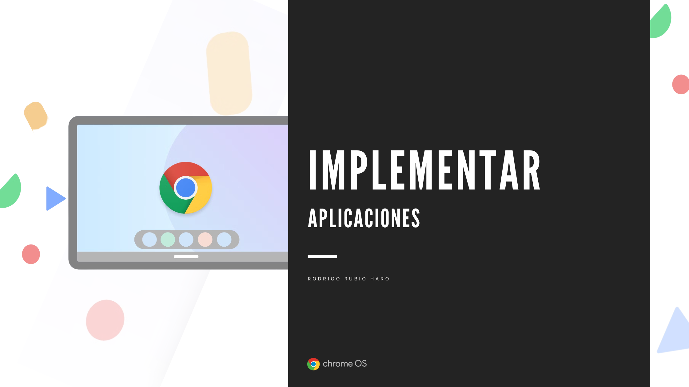
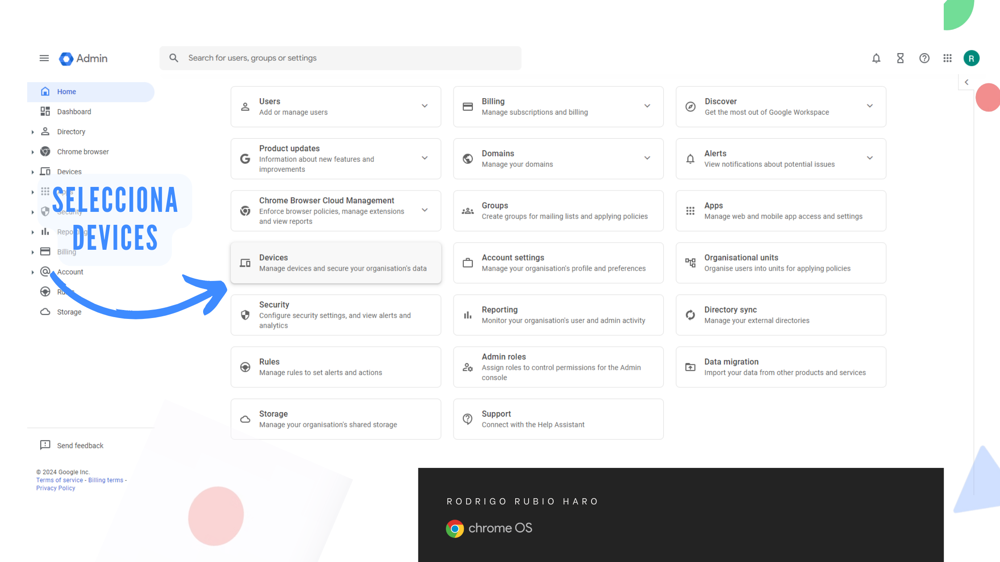
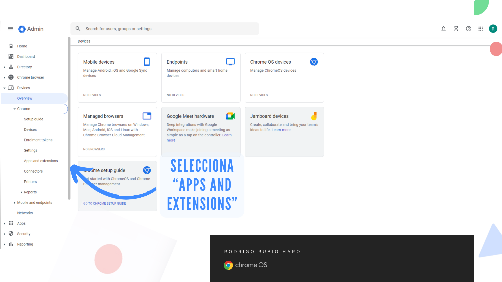
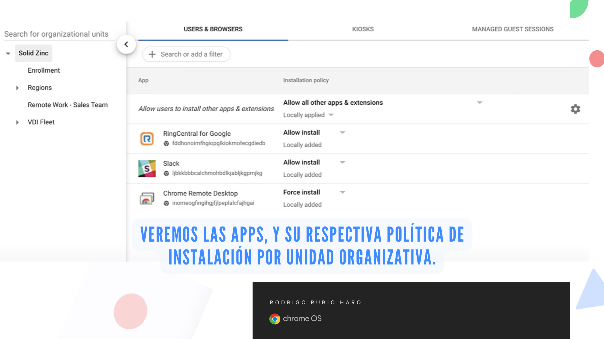
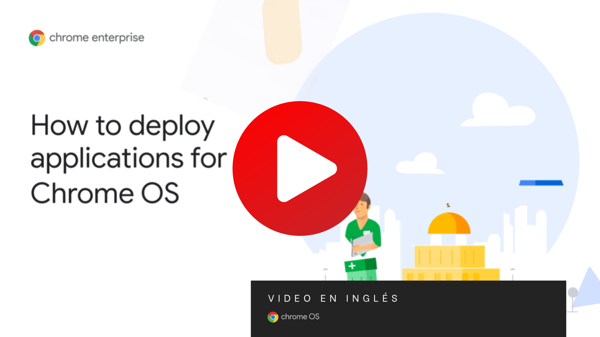

# Sección 1.3 Implementar aplicaciones

## Índice de la Sección

1. Configurar "Configuración de la aplicación"
2. (extra) Aplicaciones en Chrome OS
3. Listas de aplicaciones permitidas y no permitidas.

## 1. Configurar "Configuración de la aplicación"

Las aplicaciones son una parte importante de la experiencia de usuario en Chrome OS. Los administradores pueden configurar las aplicaciones que se instalan en los dispositivos de los usuarios. 

### 1.1 Instalación de aplicaciones y extensiones

Puede instalar automáticamente extensiones y apps de Chrome específicas para los usuarios de su organización. Luego, los usuarios verán estas aplicaciones y extensiones cuando usen Chrome en cuentas o dispositivos administrados.

La mayoría de las extensiones y apps de Chrome se encuentran en Chrome Web Store. También puedes instalar de manera automática apps y extensiones de terceros. Los usuarios no pueden quitar elementos que se hayan instalado de manera automática. 

Consideraciones importantes antes de comenzar:

* Para realizar la configuración de un grupo específico de usuarios o de navegadores Chrome inscritos, incluye las cuentas de usuario o los navegadores en un grupo o una unidad organizativa. Solo se pueden agregar cuentas de usuario a los grupos, no navegadores. 
* Para aplicar la configuración a los usuarios del navegador Chrome en computadoras con Windows, Mac o Linux, active la administración del navegador Chrome en la unidad organizativa a la que pertenezcan. 
* Hay un límite de 500 para la cantidad total de apps multiplicada por la cantidad de grupos.

Pasos para instalar automáticamente apps y extensiones:

1. En la Consola del administrador, ve a Menú -> Dispositivos -> Chrome -> Apps y extensiones. La página Vista general se abre de forma predeterminada.

2. En la parte superior, haz clic en el tipo de app o extensión que quieres instalar automáticamente:

    * Usuarios y navegadores: Para usuarios que acceden con una Cuenta de Google administrada en cualquier dispositivo y para navegadores inscritos
    * Sesiones de invitado administradas: Para usuarios que acceden a una sesión de invitado administrada en un dispositivo ChromeOS administrado

3. A la izquierda, elige para quién quieres instalar la app automáticamente:
    * Usuarios y navegadores: Para aplicar el parámetro de configuración a todos los usuarios y navegadores, deja seleccionada la unidad organizativa superior. De lo contrario, selecciona una unidad organizacional o un grupo secundarios.
    * Sesiones de invitado administradas: Para aplicar el parámetro de configuración a todos los usuarios, deja seleccionada la unidad organizativa superior. De otro modo, seleccione una unidad organizativa secundaria.

4. Busca la app o extensión que quieres instalar automáticamente y haz clic en ella.
5. En el panel que se abre a la derecha, en Política de instalación, elige Instalar de manera automática o Instalar de manera automática y fijar a la barra de tareas de ChromeOS.
6. Haz clic en Guardar. Si configuraste una unidad organizativa o un grupo, es posible que puedas heredar o anular una unidad organizativa superior o desactivar un grupo.

El siguiente video muestra cómo instalar automáticamente aplicaciones y extensiones en Chrome OS:

Recuerda que los videos están en inglés, pero puedes activar los subtítulos en español.

Consideraciones adicionales
* Cuando permite que una aplicación o extensión se instale automáticamente, también se le otorga permiso para acceder a la información del dispositivo en el que se instala. Por ejemplo, una aplicación podría acceder a los marcadores de un usuario o usar su ubicación. También puede acceder al ID de la API de Directory de un dispositivo a través de una API de extensión.
* Las apps instaladas de manera automática pueden usar la API de Chrome enterprise.platformKey sin solicitar permiso.
* El ID o la URL de la app que usó para instalar una app de manera automática nunca cambian. Debido a que los editores de las aplicaciones determinan los íconos y los nombres visibles de las aplicaciones, puede cambiarlos en cualquier momento. Si un editor cambia el ícono o el nombre de la aplicación, esos cambios se actualizan de inmediato en las aplicaciones instaladas de manera automática, en los dispositivos de los usuarios.

Referencias:
* Cómo instalar automáticamente aplicaciones y extensiones: https://support.google.com/chrome/a/answer/6306504