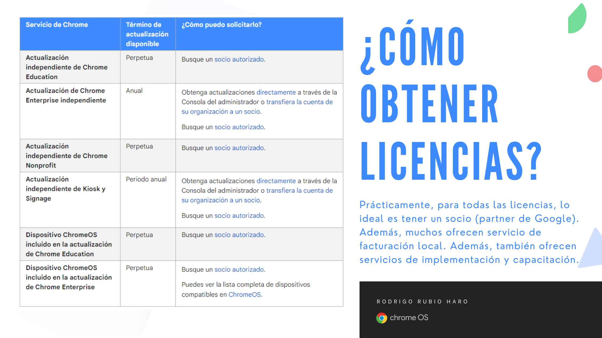
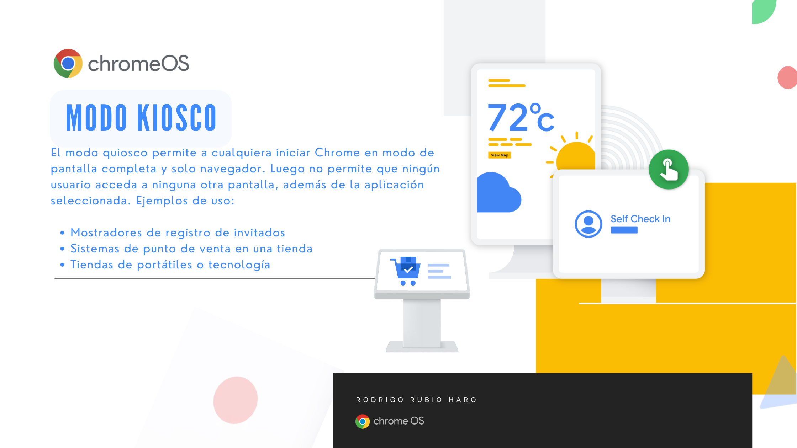

# Sección 1.5 Provisión de licencias

## Índice de la Sección

1. Provisionar licencias anuales
2. Provisionar licencias perpetuas
3. Provisionar licencias Chrome sin fines de lucro
4. CBE (Chromebook Enterprise/Chrome Browser Enterprise)
5. Identificar el tipo de licencia

## Sobre el Licenciamiento

Puedes comprar dispositivos ChromeOS con Chrome Enterprise Upgrade o Chrome Education Upgrade. Cada dispositivo incluye una actualización perpetua integrada que cubre la vida útil del dispositivo.

Si tienes dispositivos ChromeOS independientes, es decir, dispositivos que no contaban con Chrome Enterprise o Chrome Education, necesitas comprar una actualización independiente para cada uno de estos dispositivos que desees administrar.

Nota importante: Tu cuenta determina qué funciones de Chrome están disponibles para ti. Por ejemplo, si tu organización tiene una cuenta educativa y inscribes un dispositivo ChromeOS que incluye Chrome Enterprise Upgrade, no puedes acceder a las funciones de Chrome que son exclusivas de las cuentas empresariales.

### Consideraciones importantes (resumen)
* Dispositivos con Licenciamiento incluido
    * La actualización cubre la vida útil del dispositivo.
    * No puedes transferir una actualización de un dispositivo a otro en el mismo dominio, incluso si encuentras un problema de hardware y necesitas reemplazarlo.
    * Puedes volver a inscribir un dispositivo en otro dominio, a menos que hayas bloqueado la transferencia por política, como la reinscripción forzada.

* Dispositivos sin Licenciamiento incluido (Independientes)
    * Se puede comprar una actualización Anual
        * Se puede comprar una licencia anual que puede renovarse cada año.
    * Se puede comprar una actualización Perpetua
        * Para Education y para Organizaciones sin fines de lucro, leer las condiciones de licenciamiento.

## 1. Provisionar licencias anuales

Las licencias anuales son licencias que se renuevan cada año. Estas licencias son ideales para empresas que desean mantenerse actualizadas con las últimas funciones y actualizaciones de seguridad. Aunque cctualmente, no hay un plan flexible disponible, puedes comprar licencias adicionales a mitad de término y el costo se prorratea, y la nueva licencia vence al mismo tiempo que tu pedido original.

Puedes desinscribir un dispositivo y transferir la actualización a otro dispositivo (de cualquier modelo) en el mismo dominio.

Puedes transferir una actualización a un dispositivo en otra cuenta de organización.

## 2. Provisionar licencias perpetuas

Para versiones Enterprise y Education:

Cubre la vida del dispositivo al que se inscribe.

No puedes transferir una actualización de un dispositivo a otro en el mismo dominio, incluso si encuentras un problema de hardware y necesitas reemplazarlo.

Puedes volver a inscribir un dispositivo en otro dominio, a menos que hayas bloqueado la transferencia por política, como la reinscripción forzada.

## 3. Provisionar licencias Chrome sin fines de lucro

Cuando compras actualizaciones permanentes, se asignan a un grupo hasta que las uses para inscribir dispositivos ChromeOS independientes. Cada actualización cubre la vida del dispositivo al que se inscribe.

Si encuentras un problema de hardware y necesitas reemplazar un dispositivo, puedes transferir la actualización a otro dispositivo del mismo modelo (o reemplazo proporcionado por el fabricante).

No puedes transferir una actualización de un dispositivo a otro en el mismo dominio.

No puedes transferir una actualización a un dispositivo en otra cuenta de organización.

Todas las transferencias de actualizaciones se auditan. Si se detecta un uso indebido, se pueden tomar medidas, como la desactivación de las actualizaciones.

## 5. Identificar el tipo de licencia

Cómo administrador de los diferentes dispositivos ChromeOS, es importante que identifiques el tipo de licencia que tienes para cada uno de los dispositivos que administras. Esto te permitirá tomar decisiones informadas sobre la administración de los dispositivos y la adquisición de nuevas licencias. Ahora, ¿cómo se obtienen las licencias?

La recomendación es que te pongas en contacto con un partner de Google para obtener más información sobre las licencias. Puedes buscar partners de Google en el siguiente enlace: [Google Partners](https://cloud.google.com/find-a-partner/?products=Chrome). En México puedes contactar a eSource Capital en el siguiente enlace: [eSource Capital](https://www.esourcecapital.com/). La siguiente imagen muestra  los tipos de licencias disponibles de ChromeOS.

### 5.1 Licencias del Modo Kiosco

El Modo Kiosco es una forma de administrar dispositivos ChromeOS para que se utilicen para una sola tarea, como un quiosco de información o un punto de venta. Puedes configurar dispositivos ChromeOS para que se ejecuten en Modo Kiosco con licencias de Modo Kiosco. Un ejemplo de modo kiosco es el de un quiosco de información en un aeropuerto donde los usuarios pueden buscar información sobre vuelos y destinos. En una empresa, el modo kiosco se puede utilizar para mostrar información de la empresa en una pantalla en el vestíbulo.

La siguiente imagen muestra una breve descripción de las licencias de Modo Kiosco.

Las licencias de Modo Kiosco se pueden adquirir directamente en la consola de administración de Google. O bien, mediante un partner de Google. Estás licencias se pueden adquirir, de momento, de forma anual. 
