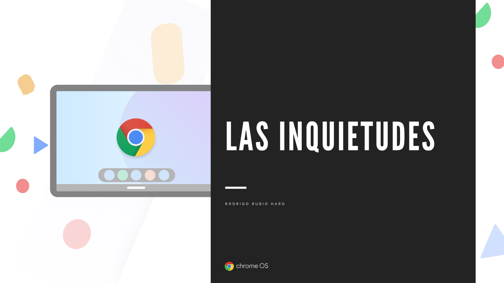
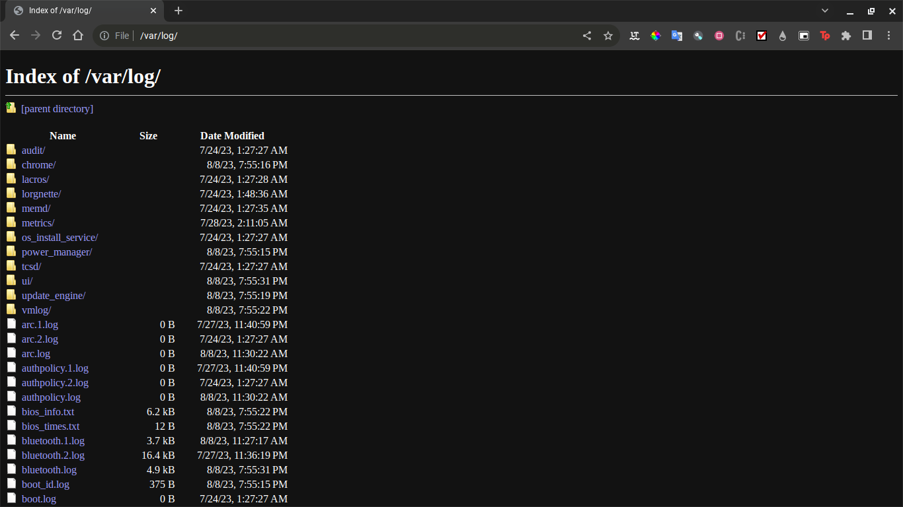
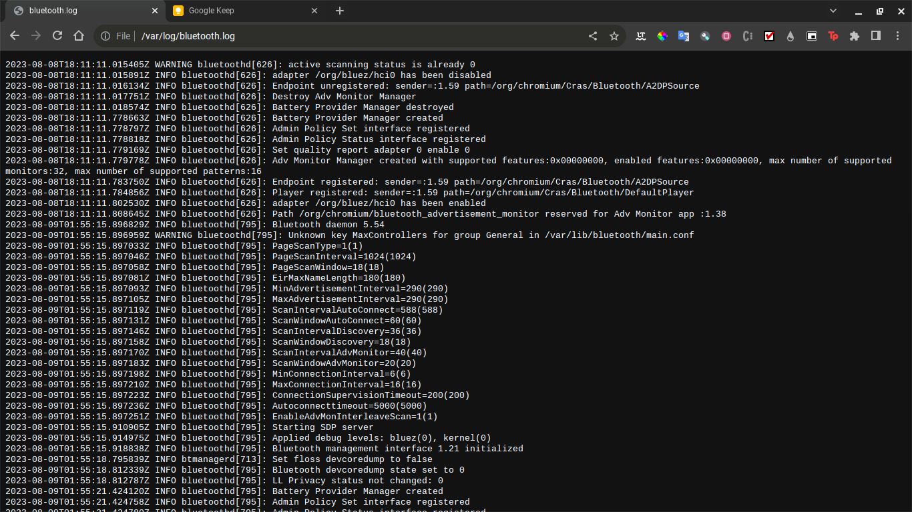
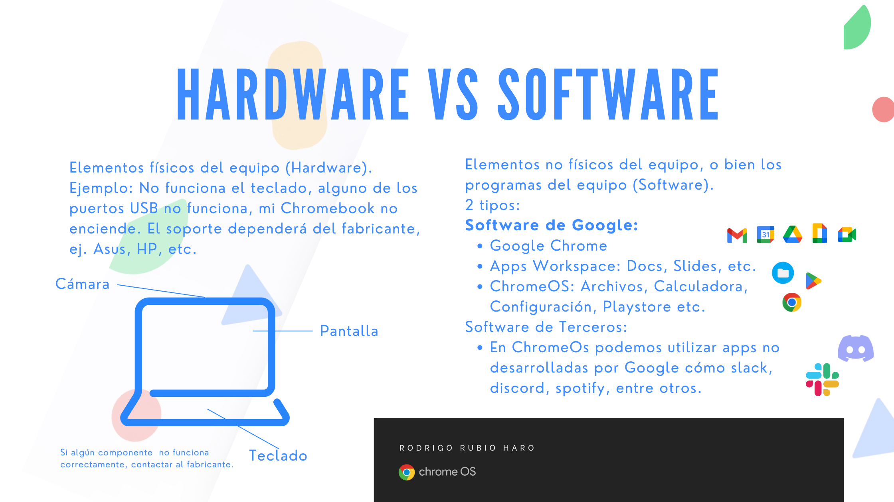
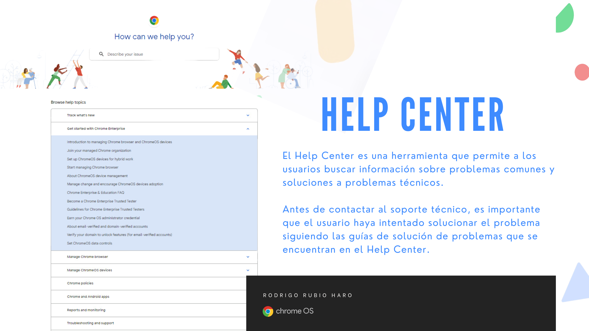
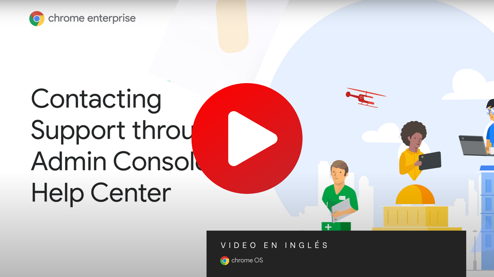

# Sección 2. Solución de Problemas a Inquietudes de los Clientes

## Índice de la Sección

1. Borrar dispositivos 
2. Obtener registros de dispositivos (desde el dispositivo) 
3. Registrar tickets de soporte
4. Resolver problemas de conectividad 
5. Ayudar al inicio de sesión de los usuarios por primera vez 
6. Comprobar los dispositivos manualmente para las actualizaciones 
7. Enviar solicitudes de características
8. Estar al tanto del Programa de Probadores de Confianza
9. Informar a los socios de las notas de la versión

## Inquietudes de los Clientes

Google Chrome OS a comenzado a implementarse por diferentes organizaciones debido a las diversas ventajas cómo la seguridad y el rendimiento. Sin embargo, debido a que ChromeOS es un sistema operativo relativamente nuevo, es natural enfrentarse a diversas inquietudes relacionadas con temas de funcionalidad, seguridad entre otras. Esta sección busca resolver dichas inquietudes. Así cómo dar una guía de cuando conviene o no utilizar ChromeOS comenzando con algunos de los mitos de ChromeOS:

* ChromeOS requiere de internet para funcionar. 
* ChromeOS requiere licencias de Google.
* ChromeOS es solo para equipos antiguos o legados.

## Operando en la Consola de Administración: Solución de Problemas de las Inquietudes de los Clientes

### 1. Borrar Dispositivos
Inscribe los dispositivos Chrome que deseas gestionar desde tu Consola de administración. Borra o desprovee los dispositivos perdidos o robados.

Seguir en [1.Inscribir y Borrar](./1.InscribiryBorrar/README.md)

### 2. Obtener registros de dispositivos (desde el dispositivo) 
Al momento de encontrar errores o funciones que no brindan los resultados esperados, es necesario leer la documentación y en caso de confirmar que algún componente o función no funciona correctamente es importante, antes de contactar el soporte técnico, contar con los registros del dispositivo: 

Los registros de tu dispositivo Chrome pueden ser analizados con Log Analyzer (https://toolbox.googleapps.com/apps/loganalyzer/) para intentar identificar el problema que se está experimentando. Si aún así no es posible resolver el problema, tener los registros a la mano cuando se haga contacto con el equipo de Asistencia facilitará la resolución del problema.

Antes de ponerte en contacto con el equipo de Asistencia, te recomendamos que obtengas los registros (o logs) de tu dispositivo Chrome gestionado y los analices con Log Analyzer para intentar identificar el problema que estás experimentando. Si no consigues resolver el problema, ten los registros a mano cuando te pongas en contacto con el equipo de Asistencia.

Los logs pueden ser consultados desde el navegador, estos se encuentran en la ruta de sistema: /var/log, y podemos acceder a ellos desde el navegador escribiendo file:///var/log en la barra de direcciones. Como se muestra en la siguiente imagen.

Ejemplo de Logs mostrados desde el navegador. 

Podemos descargar estos logs, o visualizarlos directamente haciendo click en el log deseado.

Ejemplo de log de bluetooth.

Documentación sobre logs: https://support.google.com/chrome/a/answer/6270826?hl=en#zippy=%2Ccollect-network-logs%2Cread-the-logs-manually

### 3. Registrar tickets de soporte

El soporte técnico de se divide en 2 categorías: Soporte para dispositivos Chrome, es decir Soporte para problemas de Hardware y Soporte para ChromeOS, es decir problemas de software.

El soporte se puede consultar mediante el siguiente enlace: https://support.google.com/chrome/a/answer/4389193?hl=en#zippy=%2Ctroubleshooting-resources
O bien en el Help Center de Google para Chrome en: https://support.google.com/chrome/a/?sjid=2507482886009163115-NC#topic=7679105 

El Help Center es una herramienta que permite a los usuarios buscar información sobre problemas comunes y soluciones a problemas técnicos.
Antes de contactar al soporte técnico, es importante que el usuario haya intentado solucionar el problema siguiendo las guías de solución de problemas que se encuentran en el Help Center.

En el siguiente video se puede ver un ejemplo de cómo registrar un ticket de soporte.

### 4. Resolver problemas de conectividad 

El terrible error: "No se puede conectar a la red" es uno de los problemas más desagradables, en especial cuando tenemos una reunión importante ¿no es así?. A continuación, se presentan algunas soluciones a problemas de conectividad. 

Si no puedes conectar algun dispositivo Chrome a Internet, sigue estos pasos para solucionar el problema:

- Comprueba que la red a la que el dispositivo está conectado se ha configurado correctamente. Revisa la contraseña de la red y asegúrate de que el dispositivo esté dentro del rango de la red.
- Prueba a conectar el dispositivo a otra red. Con esto descarta que el problema sea con la red a la que el dispositivo está conectado.
- Si el problema no se soluciona, puedes acceder al modo invitados con el enlace que aparece en la pantalla anterior para utilizar las herramientas de diagnóstico de red.

Los dispositivos Chrome admiten los tipos de red Wi-Fi más comunes, como:

Estándares: 802.11 a/b/g/n y 802.11ac para los Chromebooks que dispongan de CA
Seguridad: WEP, WPA/WPA2, EAP-TLS, EAP-TTLS, EAP-PEAP y TKIP.

#### La red requiere un inicio de sesión

Algunas redes requieren un inicio de sesión antes de poder acceder a Internet. Si la red que utilizas tiene un portal o requiere que inicies sesión y aceptes un contrato para acceder a Internet, es posible que tu dispositivo tenga dificultades para conectarse a Internet si aún no ha sido configurada por primera vez. Configura el equipo en una red que no requiera un inicio de sesión para poder acceder a Internet y, a continuación, vuelve a intentar conectarte a la red original.

#### El Wi-Fi conecta pero aún no puedo acceder a Internet

En caso de que aún no puedas conectarte a Internet, conecta el equipo a la red mediante cable Ethernet o un adaptador USB. Si el equipo se conecta a Internet mediante un cable Ethernet o un adaptador USB, es posible que el problema esté relacionado con el Wi-Fi. Si el equipo no se conecta a Internet mediante un cable Ethernet o un adaptador USB, es posible que el problema esté relacionado con la red o el router.
Tip: Intentar prender y apagar el Wi-Fi puede ayudar a solucionar problemas de conectividad. En otros casos, es posible que sea necesario reiniciar el router (contacta al administrador de red).

### 5. Ayudar al inicio de sesión de los usuarios por primera vez

El cambio de un sistema operativo a otro puede ser todo un reto, por lo que es importante ayudar a los usuarios a realizar el cambio de manera sencilla, transparente y con paciencia, mucha paciencia.

Tip: Que el usuario entienda el cambio y las ventajas que este trae consigo, puede ayudar a que el proceso sea más sencillo. El siguiente recurso me ayudó a entender el mundo en constante cambio en el que vivimos, del autor Spencer Johnson, "¿Quién se ha llevado mi queso?". Disponible en Amazon: [https://www.amazon.com.mx/Quien-Se-Ha-Llevado-Queso/dp/8495787091](https://www.amazon.com.mx/Quien-Se-Ha-Llevado-Queso/dp/8495787091)

Para Iniciar Sesión por primera vez en un dispositivo Chrome, tenemos las siguientes opciones:

1. Iniciar sesión con una cuenta personal de Google

    Se pedirá que introduzca su nombre de usuario y contraseña en el cuadro de inicio de sesión. 

2. Iniciar sesión como invitado

    También puede utilizar el Chromebook sin una cuenta de Google seleccionando Examinar como invitado.
    En el modo invitado, el usuario puede navegar por la web y utilizar las aplicaciones. Es posible que algunas funciones no estén disponibles en el modo invitado.

3. Iniciar sesión con una cuenta de usuario de Google Workspace
    
    Puede inscribir el Chromebook si selecciona Inscripción Enterprise. Si selecciona Inscripción de usuario, el Chromebook se inscribirá en la cuenta de usuario de Google Workspace que el usuario introduzca.
    
4. Crear una cuenta personal de Google

    Puede crear una nueva cuenta de Google si aún no dispone de una. Deberá seleccionar Crear una cuenta de Google

Como administrador de ChromeOs, la mayoría de la configuración de los dispositivos se realiza desde la consola de administración. Sin embargo, hay algunas configuraciones que los usuarios pueden cambiar en sus dispositivos. Y deberá evitarse el uso de cuentas de usuario personales para la configuración de los dispositivos que pertenezcan a la organización, ya que los datos de la organización podrían verse comprometidos.

Nota Importate: Solo la cuenta del propietario puede cambiar ciertas opciones de configuración de ChromeOS.

### 6. Comprobar los dispositivos manualmente para las actualizaciones

Referencias: 
* https://support.google.com/chrome/a/answer/4632009?hl=es-US&ref_topic=6239504&sjid=2507482886009163115-NC 

