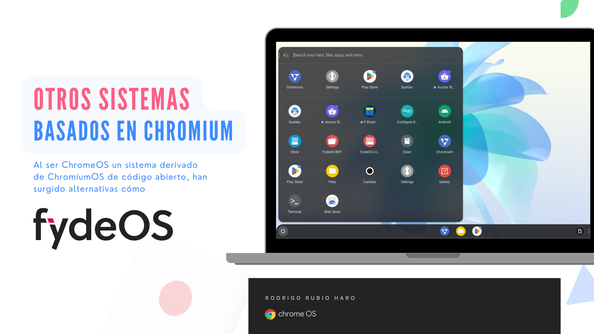
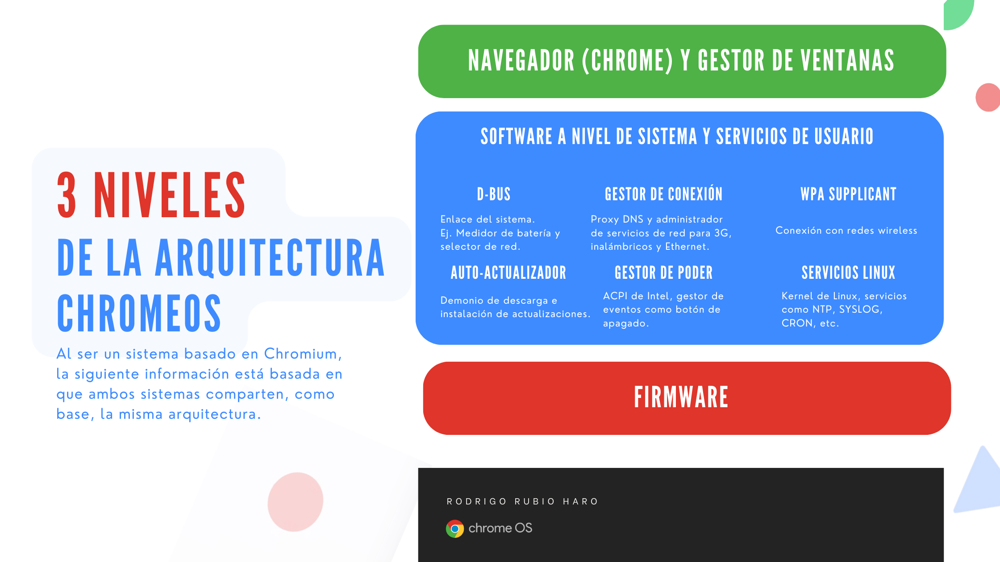
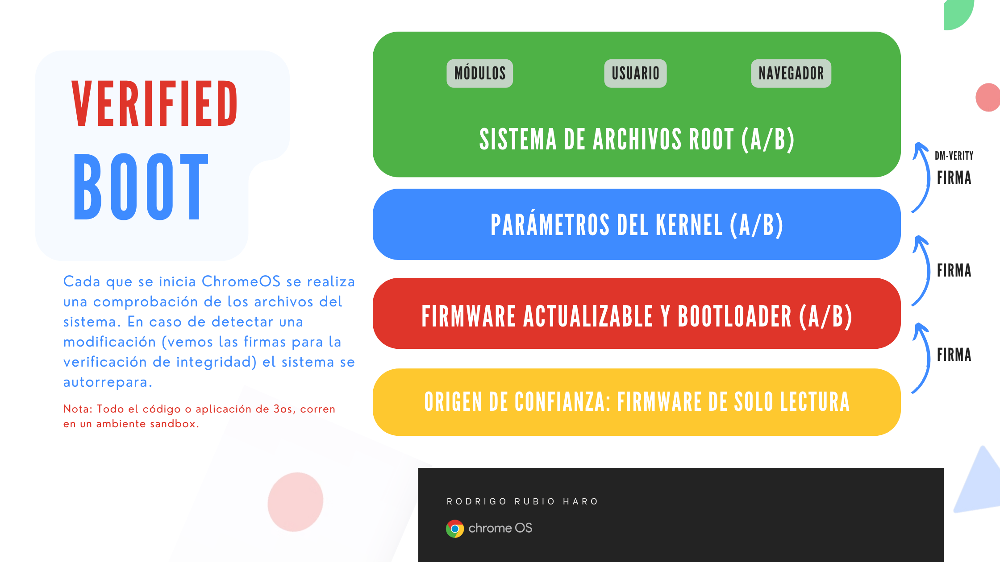

# Sección 5. Principios de ChromeOS

## Índice de la Sección

1. Comprender las mejores prácticas de ChromeOS
2. Educar a los clientes sobre los principios de ChromeOS
3. Selección del hardware adecuado

## Entendiendo el Sistema Operativo ChromeOS

Si tienes experiencia en el area de TI, sabrás que el sistema operativo ChromeOS es un sistema operativo basado en Linux, desarrollado por Google. 
Si bien, ChromeOS y ChromeOS Flex comparten tecnología subyacente y herramientas de administración. Es importante tener en cuanta las diferencias entre ambos sistemas operativos. ChromeOS Flex tiene algunas diferencias importantes en comparación con ChromeOS, que solo está disponible en Chromebooks, Chromeboxes y Chromebases.

* **Inicio Verificado y chip de seguridad**: Los dispositivos ChromeOS, es decir las Chromebooks, Chromeboxes y Chromebases; contienen un chip de seguridad de Google que ayuda a proteger el sistema y verificar que el hardware y el SO sean de confianza. Debido a que los dispositivos ChromeOS Flex no contienen un chip de seguridad de Google, el procedimiento de inicio verificado de ChromeOS no está disponible en estos dispositivos.

    Nota: Como alternativa, Microsoft revisó y aprobó el bootloader de ChromeOS Flex para admitir el inicio seguro de UEFI de manera opcional. Consulta la documentación de Bootloader de Microsoft para obtener más información y dispositivos compatibles.

* **Actualizaciones de Firmware**: A diferencia de los dispositivos ChromeOS, los dispositivos ChromeOS Flex no administran ni actualizan automáticamente su firmware BIOS o UEFI. En cambio, los OEM del dispositivo proporcionan actualizaciones. Los procedimientos de actualización varían según el modelo y deben ser administrados por administradores de dispositivos.

## Entendiendo la Arquitectura de ChromeOS (extra)

**Nota: La siguiente información es para aquellos que deseen comprender la arquitectura de ChromeOS. No es necesario para el examen.**

El sistema operativo ChromeOS se basa en el kernel de Linux, derivado del proyecto de código abierta Chromium OS. Si código abierto. De hecho, existen alternativas de código abierto.

Conoce más sobre el sistema operativo de código abierto [FydeOS](https://fydeos.io/), una alternativa de código abierto a ChromeOS.

Además es posible hacer sugerencias y contribuciones al proyecto. Disponible en [Chromium OS](https://www.chromium.org/chromium-os).

### ¿Es Linux?

Si, de hecho originalmente el equipo de Canonical, la empresa detrás de Ubuntu, fue uno de los principales socios de ingeniería en el proyecto de Chromium OS y este estaba basado en Ubuntu. Sin embargo, Google decidió cambiar a Gentoo Linux, por su sistema de gestión de paquetes, Portage, que es más rápido y flexible. Haciendo que el sistema operativo no este restrigido a ninguna distribución en particular. 

### ¿Se pueden correr aplicaciones de Linux en ChromeOS?

Si y no, ChromeOS usa Crostini, mediante KVM, una herramienta de virtualización de Linux, para ejecutar aplicaciones de Linux en una Máquina Virtual. Pero, en con el fin de obtener estabilidad y seguridad, cualquier ecosistema de usuario de Linux que se ejecute en ChromeOS se ejecuta en un entorno de contenedor, que usa por defecto Debian. Entonces, los usuarios pueden instalar aplicaciones de Linux en ChromeOS, pero estos no tienen forma de acceder al sistema de archivos de ChromeOS.

### Arquitectura de Tres Niveles

Si bien no se conoce mucho sobre la arquitectura de ChromeOS, al estar basado Chromium OS, se puede decir que tiene una arquitectura de tres niveles.

1. The Chromium-based browser and the window manager
2. System-level software and user-land services
3. Firmware

Una posible traducción de los niveles sería:

1. Navegador basado en Chromium (Chrome) y el administrador de ventanas
2. Software a nivel de sistema y servicios de usuario
3. Firmware

La siguiente imagen muestra la arquitectura de tres niveles de Chromium OS.

#### Nivel 1: Navegador basado en Chromium (Chrome) y el administrador de ventanas

The window manager is responsible for handling the user's interaction with multiple client windows. It does this in a manner similar to that of other X window managers, by controlling window placement, assigning the input focus, and exposing hotkeys that exist outside the scope of a single browser window. Parts of the ICCCM (Inter-Client Communication Conventions Manual) and EWHM (Extended Window Manager Hints) specifications are used for communication between clients and the window manager where possible. The window manager also uses the XComposite extension to redirect client windows to offscreen pixmaps so that it can draw a final, composited image incorporating their contents itself. This lets windows be transformed and blended together. The window manager contains a compositor that animates these windows and renders them via OpenGL or OpenGL|ES.

El gestir de ventanas es responsable de gestionar la interacción del usuario con múltiples ventanas de cliente. Lo hace de manera similar a otros gestores de ventanas X, controlando la ubicación de las ventanas, asignando el foco de entrada y exponiendo las teclas de acceso rápido que existen fuera del alcance de una sola ventana del navegador, cómo las teclas de Volumen, Brillo, cambio de ventanas, etc. Se utilizan, en parte, las especificaciones del ICCCM (Manual de Convenciones de Comunicación entre Clientes, por sus siglas en inglés) y del EWMH (Indicaciones Extendidas del Administrador de Ventanas, por sus siglas en inglés) para la comunicación entre clientes y el administrador de ventanas. El administrador de ventanas también utiliza la extensión XComposite para redirigir las ventanas de cliente a mapas de bits fuera de la pantalla, de modo que pueda dibujar una imagen final, compuesta incorporando sus contenidos. Esto permite que las ventanas se transformen y se mezclen entre sí. El gestor de ventanas contiene un compositor que anima estas ventanas y las renderiza mediante OpenGL o OpenGL|ES.

#### Nivel 2: Software a nivel de sistema y servicios de usuario

#### Nivel 3: Firmware

El firmware.

### Verificación de Arranque (Verified Boot)

Referencias:
* https://fydeos.io/
* https://www.chromium.org/
* https://en.wikipedia.org/wiki/ChromiumOS